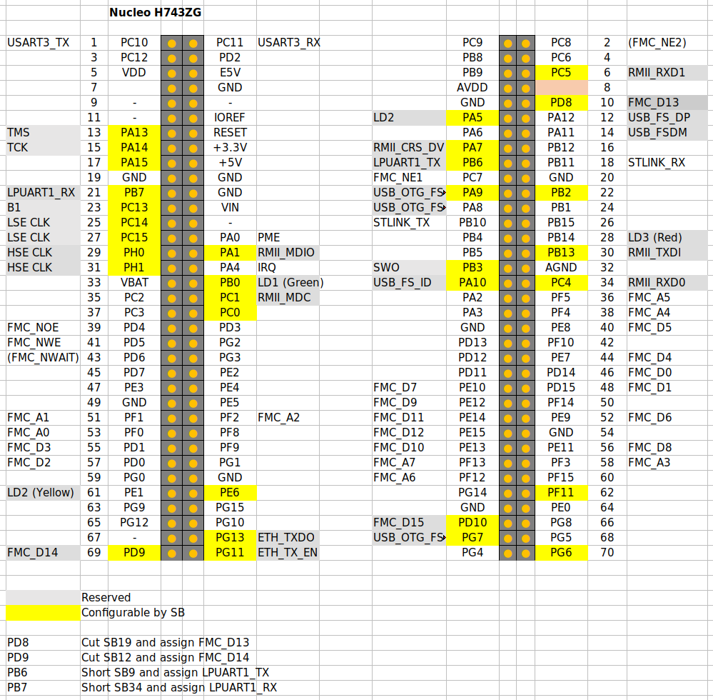

# Akashi-13
Ethernet JIG for Nucleo H743ZI2

# Details
This is a daughter board of the Nucleo H743ZI. 

The LAN9220 is accessible through the FMC SRAM configuration NE1. 
The LAN9220 doesn't have READY signal. Thus, the wait cycles should
be set by program. 

The following signals could be assigned to the interrupt (EXTI).
- PME : PA0
- IRQ : PA4

# Nucleo Pin configurations

The followings are the pin configuration of Nucleo board. 

Also, short bridge have to be configured as the followings : 

- PD8 : Cut SB12 to disconnect the STLINK VCOMM signal. 
- PD9 : Cut SB19 to disconnect the STLINK VCOMM signal. 
- PB6 : Short SB9 to assign LPUART1_TX to STLINK VCOMM signal.
- PB7 : Short SB34 to assign LPUART1_TX to STLINK VCOMM signal.

The USART3 is connected to STLINK VCOMM through the PD8 and PD9 by default. 
These pins are assigned to FMC. Thus, the LPUART1 have to be connected
to the STLINK VCOMM through the PB6 and PB7. 

PD6 (FMC_NWAIT) and FMC_NE1 (PC7) are not used in this board. 

# License
This project is licensed by the [MIT license](LICENSE). 